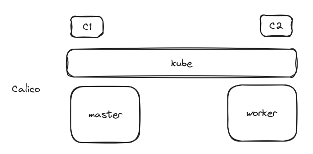

# Kubernetes

## Setup 2 node

### pre-requisites

- At least 2 vCPUs
- At least 4 GB RAM each
- At least 10 GB of disk space

### Pre-setups

- 192.168.22.84 kubemaster
- 192.168.22.85 kubeworker

## Set `kubernetes-master` and `kubernetes-worker`

1. set hostname in `/etc/hosts`
   ```
   hostname > kubemaster
   echo "192.168.22.84 kubemaster" >> /etc/hosts
   echo "192.168.22.85 kubeworker" >> /etc/hosts
   ```
2. remove swap
   `/etc/fstab`
   comment swap

To check swap, memory, etc.

```bash
free -m
swapoff -a    # swap off in runtime
free -m
```

https://kloudle.com/academy/simple-steps-to-set-up-a-2-node-kubernetes-cluster-using-kubeadm/

```bash
# vim /etc/sysctl.conf

# net/bridge/bridge-nf-call-ip6tables = 1
# net/bridge/bridge-nf-call-iptables = 1
# net/bridge/bridge-nf-call-arptables = 1
# net.ipv4.ip_forward=1
net.bridge.bridge-nf-call-iptables  = 1
net.bridge.bridge-nf-call-ip6tables = 1
net.ipv4.ip_forward                 = 1
```

```bash
# vim /etc/modules-load.d/k8s.conf

overlay
br_netfilter
```

> reboot

## Go to documentation

https://kubernetes.io/docs/home/

kubeadm kubectl kubelet

https://kubernetes.io/docs/tasks/tools/install-kubectl-linux/

### Add kubernetes registry and keys

```bash
sudo apt update
sudo apt search kubeadm

# kubeadm is not present by default, so we are adding kubernetes registry and keys
sudo apt-get install -y apt-transport-https ca-certificates curl gnupg
curl -fsSL https://pkgs.k8s.io/core:/stable:/v1.30/deb/Release.key | sudo gpg --dearmor -o /etc/apt/keyrings/kubernetes-apt-keyring.gpg
sudo chmod 644 /etc/apt/keyrings/kubernetes-apt-keyring.gpg

echo 'deb [signed-by=/etc/apt/keyrings/kubernetes-apt-keyring.gpg] https://pkgs.k8s.io/core:/stable:/v1.30/deb/ /' | sudo tee /etc/apt/sources.list.d/kubernetes.list
sudo chmod 644 /etc/apt/sources.list.d/kubernetes.list

sudo apt update -y

# search kubeadm
apt search kubeadm
```

Use kubesphere if want to setup kubernetes easily without hassle.
_Only for information_
https://kubesphere.io/

### Install containerd / dockerd ??

```bash
# cri-dockerd is required for docker and containerd to talk with each other
sudo apt -y install docker.io
wget https://github.com/Mirantis/cri-dockerd/releases/download/v0.3.17/cri-dockerd_0.3.17.3-0.ubuntu-jammy_amd64.deb
sudo apt-get install -y ./cri-dockerd_0.3.17.3-0.ubuntu-jammy_amd64.deb
```

### Setup kubectl, kubeadm, kubelet

```bash
sudo apt update -y
sudo apt-get install -y kubectl kubeadm kubelet
```

---

# Master

### Calico init

```bash
sudo kubeadm init --cri-socket=unix:///var/run/cri-dockerd.sock

kubectl get pods -A
-------------------------------
> kube-apiserver-kubeserver     # this should be up
-------------------------------

# from output of kubeadm init (run as a normal user)
mkdir -p $HOME/.kube
sudo cp -i /etc/kubernetes/admin.conf $HOME/.kube/config
sudo chown $(id -u):$(id -g) $HOME/.kube/config


curl https://raw.githubusercontent.com/projectcalico/calico/v3.29.3/manifests/calico.yaml -O
kubectl apply -f calico.yaml

# kubeadm join ..  output of previous "kubeadm init --cri-socket=unix:///var/run/cri-dockerd.sock"
# run it from normal user ... withot sudo

kubectl get nodes
----------------------
> control-plane Ready   # might take a while to get ready
----------------------
```

# Worker

```
set /etc/hosts
remove swap /etc/fstab
/etc/systemctl.conf
/etc/modules-load.d/k8s.conf

modprobe overlay
modprobe
```

everything except calico and dockerd/containerd

Summary:

- set /etc/hosts
- disable swap /etc/fstab
- /etc/systemctl.conf
- /etc/modules-load.d/k8s.conf
- kubeadm, kubelet and kubectl installed
- docker.io, cri-dockerd

add join from kubeadm init of master

```bash
sudo kubeadm join 192.168.22.84:6443 --token rzwwuk.kgog0monchz2hehc \
        --discovery-token-ca-cert-hash sha256:a4f91b71b3e99ba275785c2545016b67bdaeb64d0f9a9026db62410dd605f438 \
        --cri-socket=unix:///var/run/cri-dockerd.sock
```

`kubectl get nodes` in master

---


